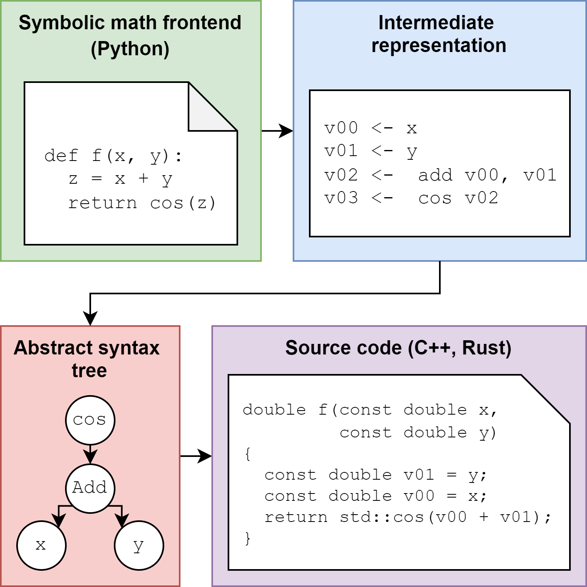
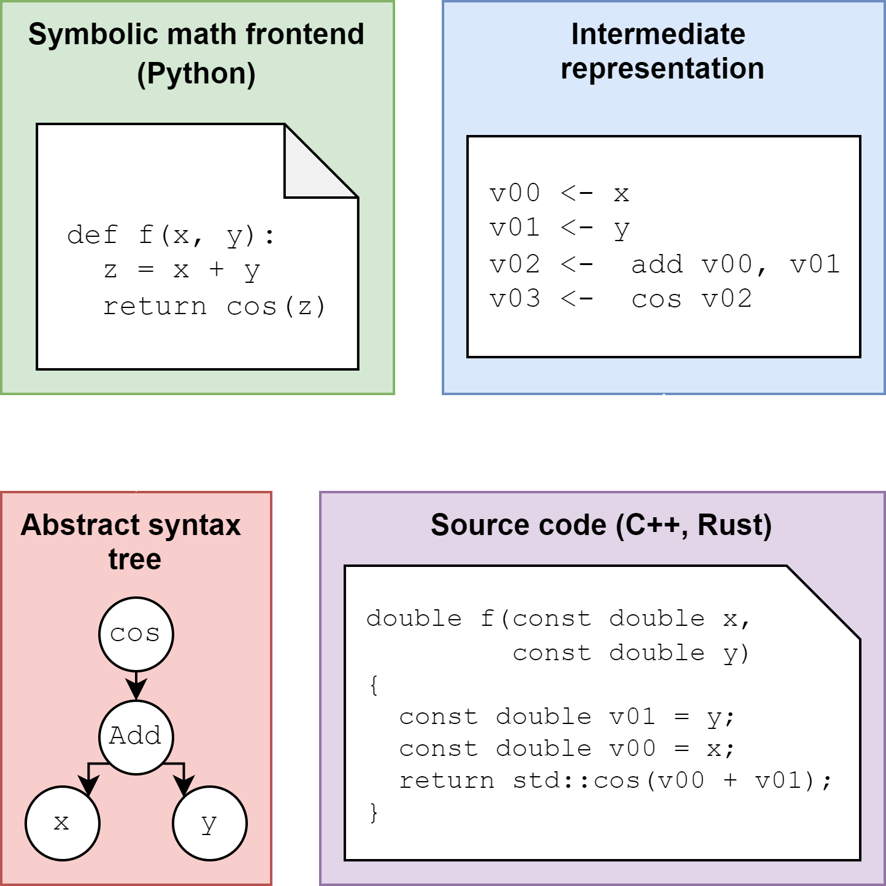

Introduction
============

wrenfold is composed of two parts:

#. A symbolic math frontend accessible in Python.
#. A code generation backend that converts symbolic math to runtime code.

Conceptually, the framework behaves somewhat like a `transpiler <https://en.wikipedia.org/wiki/Source-to-source_compiler>`_
that converts math into code. At a high level, the steps involved are:

#. The user implements a Python function that specifies a mathematical expression. As math
   operations are composed in Python, a **symbolic expression tree** is constructed.
#. The symbolic expression tree is flattened into to a simple **intermediate representation** (IR).
   Common sub-expressions are eliminated by manipulating this representation.
#. An **abstract syntax tree** (AST) matching the simplified IR is assembled. This representation is intended to
   be generic, such that nearly any language can be emitted downstream.
#. A **code generator** converts the AST into a target language (eg. C++). The code generator may be
   customized from Python in order to suit the needs of a particular project.

At present, wrenfold can target C++ and Rust, but it can be extended to other languages relatively
easily.
